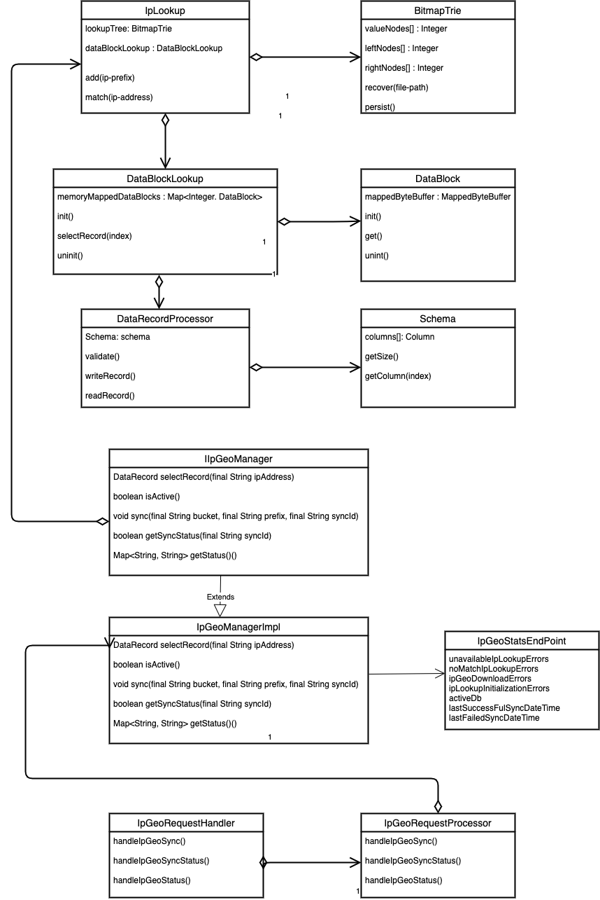

# **IP-Geo Lookup**
### **use case**
Provide Longest Prefix Match Implementation for IPv4 Addresses with following properties

1. Reliable: Results of IP-Geo lookup are always correct under all conditions
2. Available: IP-Geo lookup operation has to be highly available on each bidder instance
3. Scalable: As number of rows of IP Address increase in each region, solution must scale to accommodate new IP-Geo mappings
4. Maintainable: As size of IP-Geo lookup increases, solution must be in a maintainable state for future change requests

## **Design**
**IPv4 structure**

 

1. IPv4 address has 32 bits representation in memory
1. IPv4 can be represented using 32 bit integer value
1. Value of each bit can be either 0 or 1
1. Above memory block represents 255.255.255.0 in readable format grouping 8 bits

**Data Structure Considerations**

1. Finding longest prefix match involves, finding best possible result among set of IP records based on longest matching path. So matching IP number bits against search efficient & memory efficient data structure is needed

 

\2. Trie Data Structure will satisfy both requirements(search & memory efficiency). We could also use Multi bit trie for IPv6 addresses to reduces search length.

\3. If we use trie with recursive objects representation, it is not possible to do persistency & recovery of indices in quick time, because reading one object at a time from file & re-constructing trie will take more time. We cannot afford more recovery time. This problem can be solved if we use Trie Data Structure represented using Array because file IO operations can be performed much faster when bulk IO is performed using Array representation of Trie.

\4. We need to store records for each IP address in Trie. If we store each record in trie, it will significantly increase the Heap size & hence recovery time is more. So next best option is to keep the records in file itself and use trie leaf nodes pointing to line no in the file where Record can be found.

\5. Doing IO operation for each search is time taking operation & Also Random access to File is needed to access random bytes that constitute line. To overcome this, we can use Random Access File which supports random access to file and also Map the file contents to portion of memory for faster data access.

\6. We can Memory map maximum of 2G. If the file size is greater than 2G, mapping same file multiple times for different memory portions is needed.

\7. Also we use INTEGER for representing line no which means we will have limitation where maximum no records must be less than MAX integer value.

 

\8. Also Array uses Integer index. So Practically Trie size cannot be greater than Integer.MAX\_VALUE

\9. 

 

**Complexity Analysis**

 

As a general rule of thumb, 

1. Insertion of '0s' is performed on left nodes
1. Insertion of '1s' is performed on right nodes
1. Image how tree insertion works, as long as prefix bits are matching we don’t insert any new nodes because they are already part of tree. Moment when bit mismatch happens, tree insertion takes different approach where new node is inserted as a new branch. Same approach is taken in case of array as well. As long as prefix bits are matching no nodes are inserted into the [array](http://array.It). Moment when prefix mismatch happens new branch needs to be inserted in array. Only difference b/w graph & array data structure is insertion approach. Graph uses object references to point to child nodes where as array uses special pointer(integer index) that will tell what is the next node where insertion should happen

**1 bit representation**

1 bit can be either 0 or 1

Bit 0 is added as left node & Bit 1 is added as right node

**inserting 0:** 0 is inserted as left node. Initial **pointer** will be 1 because thats where next space is available hence 1 is added in index 0 of left array. Next there is no bit available. Hence value is inserted at index 1 of value nodes and **pointer** is incremented to 2 because that is the next available slot in array

**inserting 1:** 1 is inserted as right node. Now **pointer** will be 2 because thats where next space is available. Bit 1 needs to be inserted in right nodes. There is no prefix 1 already present in the trie and hence **pointer** value of 2 is inserted into the index 0 of right nodes. This can be compared exactly to the branching strategy that is applied in case of graph based trie. since only 1 bit needs to be inserted in trie, value will be inserted at **pointer** 2 value node in trie. **Pointer** value gets updated to 3.

3 nodes are needed to represent 1 bit values

**Search 100:**

Matching value stored at bits 1 bit value “0“ & subnet mask is 128.0.0.0 (10000000 00000000 00000000 00000000)

“0“ is represented in bits as “0“

First bit is 0 which means we have to look into left nodes & it contains value 1.

subnet mask is only 1 bit and if values[1] contains any value, that becomes the result which is 100

**Search 200:**

Matching value stored at bits 1 bit value “1“ & subnet mask is 128.0.0.0 (10000000 00000000 00000000 00000000)

“1“ is represented in bits as “1“

First bit is 1 which means we have to look into right nodes & it contains value 2.

subnet mask is only 1 bit and if values[2] contains any value, that becomes the result which is 200

**n bit representation**

If maximum height of tree is n(which also means number of bits to represent in trie is n), then (2^(n+1)-1) nodes are needed to represent all the possible values that can be represented using n bits.

**Time Complexity**

Maximum possible addresses in IPv4 address space are 2^32

So 32 bits are needed to represent an IPv4 address. We only represent prefixes in Trie data-structure. Let's say (k < 32) is the average value of prefix that is inserted in trie data structure.

time complexity is O(k) on average and O(32) on worst case scenario

**Space Complexity**

Let's say (n < 2^32) is the average no of prefixes that are inserted in trie data structure.

Each node of trie takes 12 bytes

Space complexity is O(12\*n) on average and O(12\*2^31) on worst case scenario

**Is Array sufficient to represent all the addresses in IPv4 address space ?**

Simple answer **no**.

If we represent each IPv4 address individually without prefix size, then average prefix length is 32

Practically we need 32 bits to represent each IP address in trie in that case.

Number of nodes needed in which case = (2^(32+1)-1) which cannot be represented using Integer value since array uses only Integer index. 

But, 

1. we don’t get full IP addresses always. We get prefix lengths from 16 to 32. At maximum, we can store all IPv4 addresses in array trie when average prefix length is 30 or less. Because with 30 bits we can store all the prefixes available in IPv4 address space in which case no of nodes in the array trie Equals to (2^(30+1)-1). This number can be represented using signed Integer value(max value is 2^31-1)
1. Even in the worst case scenario, we don’t fill complete IPv4 address space because those addresses are from particular geographic region & not from Global IPv4 namespace.

**Class Diagram**

 
